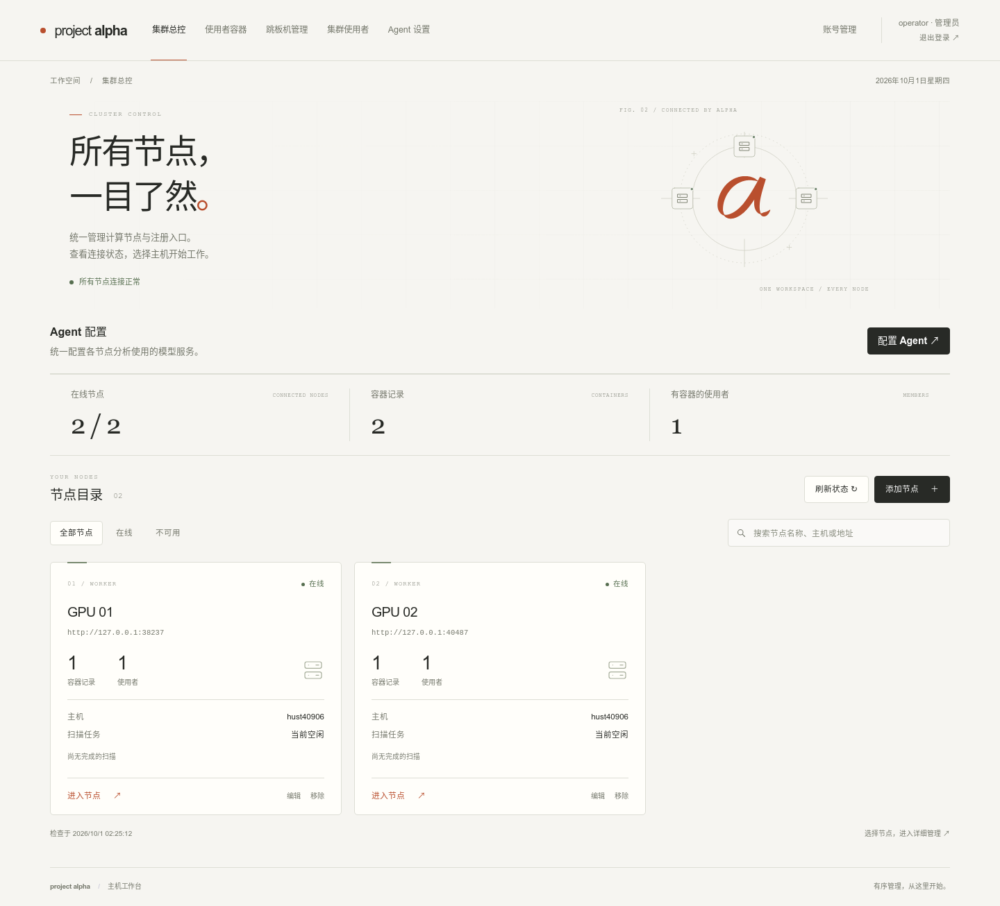

# project alpha

[English](../README.md) · 简体中文

一个自托管的服务器工作台，帮你管理多台 Linux 主机上的容器、存储和使用者。

从总控打开一台节点，就能查看空间用量、管理容器、追踪进程。多人共用服务器时，也可以在这里邀请使用者、分配工作环境，查看每个人的容器归属。

[快速开始](#快速开始) · [使用文档](#文档) · [开发说明](development.md)



*总控界面，本地测试环境中的两台计算节点。*

## 能做什么

- **管理多台主机** — 在一个页面查看节点连接状态，进入各自的工作台。
- **看清空间去向** — 按目录、容器和使用者查看存储用量，区分独占与共享空间，保留扫描记录供后续比较。
- **准备工作环境** — 创建、启停和管理容器，也能导入已有容器。
- **管理使用者** — 通过邀请码登记信息，分配容器、Tailscale 分享和 `alpha-jump` 公钥；使用者可以查看自己的资源并申请新节点上的容器。
- **辅助排查** — 查看 Tetragon 进程树，使用 Agent 分析 Host 或容器存储、生成报告，再由管理员选择清理范围。

总控负责网页和统一管理，每台计算节点运行一个 worker。两者使用同一个二进制，各自保存数据；需要公网注册时，再部署一个 registry 入口。

## 快速开始

准备一台 Linux 主机，安装 **Go 1.26+** 和 **GCC**。使用容器功能的计算节点还需要 Docker CLI，以及服务账号对 Docker daemon 的访问权限。

### 1. 启动总控

在仓库目录中构建并运行：

```bash
go build -o bin/project-alpha ./cmd/project-alpha
./bin/project-alpha --control --data-dir ./control-data
```

打开 <http://127.0.0.1:8765>，按页面提示创建管理员账号。

如果总控运行在远程服务器上，可以先通过 SSH 转发访问：

```bash
ssh -L 8765:127.0.0.1:8765 user@your-server
```

### 2. 接入计算节点

把构建好的二进制放到计算节点上，运行：

```bash
./bin/project-alpha --worker --data-dir ./node-data --host 0.0.0.0 --port 8766
```

启动日志会显示节点连接令牌。在总控点击 **添加节点**，填写名称、总控可以访问的地址（如 `http://10.0.0.11:8766`）和令牌。

总控和 worker 也可以运行在同一台机器上，使用不同的端口和数据目录即可。节点令牌会保存在 worker 的数据目录中，重启后继续使用。

### 3. 开始使用

接入后，选择节点进入工作台：

- 在 **扫描配置** 中设置扫描范围，完成扫描后查看 **空间用量**。
- 在 **容器管理** 中设置镜像、数据目录和 SSH 端口，再创建工作环境。
- 需要开放注册时，先在总控配置邀请码和使用者资源，再按 [公网注册说明](operations.md#公网-registry) 部署 registry。

长期运行可使用仓库中的 [systemd 和 nginx 配置](operations.md#部署)。节点连接、权限和接口说明见 [集群管理](cluster.md)。

## Linux Release 与 CI

[Linux CI and Release](../.github/workflows/release.yml) 在推送到 `master`、向 `master` 提交 PR 或手动运行时，执行 Go race 测试、`go vet` 和前端 JavaScript 测试，再构建 Linux amd64 / arm64 安装包。普通构建的安装包可在 Actions 页面的 Artifacts 下载，保留 14 天。

发布时，在包含此工作流的提交上创建并推送新的版本标签，例如发布 0.3.0 时：

```bash
git tag v0.3.0
git push origin v0.3.0
```

`v*` 标签推送通过全部检查和双架构构建后，自动创建 GitHub Release 并上传：

- `project-alpha_<标签>_linux_amd64.tar.gz`
- `project-alpha_<标签>_linux_arm64.tar.gz`
- `SHA256SUMS`

带连字符的标签（例如 `v0.3.0-rc.1`）标记为预发布。失败后可在 Actions 重跑；已有 Release 的同名附件会被替换。分支推送、PR 和手动运行只生成 Artifacts，不发布 Release。使用仓库内置的 `GITHUB_TOKEN`，无需额外配置 Secret。

压缩包包含 `bin/project-alpha`、`bin/rootless-docker`、`README.md`、`docs/`、`deploy/` 和记录版本、提交、架构及 Go 版本的 `BUILD_INFO`。网页资源已嵌入主程序，无需另行构建前端。

二进制在 Ubuntu 20.04 容器内按对应架构原生编译，启用 CGO 以支持 SQLite；运行环境使用 glibc 2.31 或更新版本（例如 Ubuntu 20.04），不直接支持 Alpine/musl。使用发布包无需安装 Go 或 GCC；Docker 等功能仍需对应的运行时依赖。更旧的 Linux 发行版可按 [快速开始](#快速开始) 从源码构建。

工作流使用 Ubuntu 24.04 runner，编译器、头文件、链接库和打包后程序检查均在 `ubuntu:20.04` 容器内执行。CI 会检查容器 glibc 版本和二进制的 GLIBC 符号要求，拒绝超过 2.31 的构建；发布构建不复用宿主机的 Go/CGO 缓存。

下载对应架构的压缩包和校验文件后，例如使用 0.3.0 版本时：

```bash
# 仅校验已下载的架构；同时下载两种架构时也可去掉 --ignore-missing。
sha256sum --check --ignore-missing SHA256SUMS
tar -xzf project-alpha_v0.3.0_linux_amd64.tar.gz
cd project-alpha_v0.3.0_linux_amd64
./bin/project-alpha --control --data-dir ./control-data
```

## 文档

| 想了解什么 | 从这里开始 |
| --- | --- |
| 节点接入、运行角色与权限 | [集群管理](cluster.md) |
| 创建、导入和管理容器 | [容器管理](containers.md) |
| 邀请码、登记表与使用者注册 | [使用者登记](members.md) |
| share node 初始化、总控 SSH 身份与排错 | [share node 配置指南](share-node.md) |
| Tailscale 分享、跳板公钥与资源回收 | [跳板机与使用者资源](bastion.md) |
| 空间用量如何计算 | [存储统计口径](accounting.md) |
| 扫描记录、目录探索与增量更新 | [记录读取与探索](records.md) |
| Agent 报告与诊断清理 | [Agent API](agent.md) |
| 公网注册、数据备份与服务部署 | [运行与配置](operations.md) |
| 独立 rootless Docker 工具 | [rootless Docker](rootless-docker.md) |
| 测试、性能基准与代码结构 | [开发与验证](development.md) |

## 开发

后端使用 Go 和 SQLite，网页资源嵌入二进制。常用检查：

```bash
go test -race ./...
go vet ./...
for test in tests/test_*.js; do node "$test" || exit; done
```

前端测试需要 Node.js 20+，无需安装 npm 依赖。浏览器回归和 Docker 集成测试的运行方式见 [开发与验证](development.md#验证)。

当前版本为 **0.3.0**，仍在持续开发。1.0 发布前，数据库、配置、API 和快照格式可能变化，不提供旧格式迁移；遇到格式不匹配时，需要使用新的数据目录，已有数据会保留。[数据保存与备份说明](operations.md#配置与数据)。
