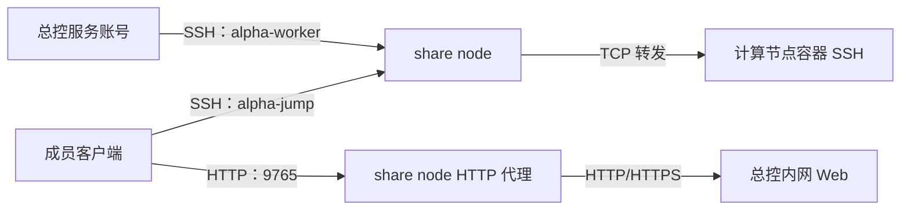

# share node 配置指南

share node 为成员提供两个入口：通过固定账号 `alpha-jump` 转发 SSH 到计算节点上的容器，通过 HTTP 代理访问总控的本人状态页。总控使用自己的普通服务账号及其在总控创建并启用的 SSH 密钥登录 share node 的 `alpha-worker`，远程发布、查询和撤销成员公钥。

本文按总控、share node、成员客户端分别说明操作。成员分配、邀请核对和资源 API 见 [跳板机与使用者资源](bastion.md)。

## 地址与连接关系

以下示例使用这些地址；部署时替换为实际值。

| 项目 | 示例 | 配置位置 |
| --- | --- | --- |
| 总控普通服务账号 | `project-alpha` | 总控 systemd 单元的 `User=` |
| 总控内网 Web 地址 | `http://10.0.0.1:8765` | 总控监听参数、share node 的 `--control-url` |
| share node Tailscale IP | `100.64.0.2` | `--listen-host`、总控分享池 |
| share node OpenSSH 端口 | `22` | share node 的 sshd 配置、总控分享池 |
| share node 网页入口端口 | `9765` | `--status-port`、总控分享池 |
| 计算节点内网 IP | `10.0.0.11` | 总控的计算节点配置 |
| 成员容器 SSH 端口 | `2222` | worker 容器分配结果 |



需要允许以下连接，Tailscale 访问策略和主机防火墙都应放行对应端口：

| 发起方 | 目标 | 用途 |
| --- | --- | --- |
| 总控 | `100.64.0.2:22` | 管理成员公钥 |
| 成员客户端 | `100.64.0.2:22` | SSH 跳板 |
| 成员浏览器 | `100.64.0.2:9765` | 本人状态页 |
| share node | `10.0.0.1:8765` | 代理总控 Web |
| share node | `10.0.0.11:2222` 及其他已分配容器端口 | 转发容器 SSH |

成员接受分享后访问 share node；连接计算节点的 TCP 请求由 share node 发起，因此计算节点地址必须从 share node 可达。分享受所属 Tailnet 的访问策略约束，参考 [Tailscale 节点分享说明](https://tailscale.com/docs/features/sharing)。

## 1. 准备总控

总控以普通服务账号运行，参考 [总控 systemd 单元](../deploy/project-alpha.service)。确认 `User=` 与后面配置 SSH 的账号一致。

让总控 Web 监听 share node 能访问的地址，例如在服务启动参数中设置：

```sh
/opt/project-alpha/bin/project-alpha --control \
  --data-dir /var/lib/project-alpha-control \
  --host 10.0.0.1 --port 8765 --allowed-host 10.0.0.1
```

首次打开总控只需创建管理员账号。总控监听地址由启动参数决定；仅监听 `127.0.0.1` 的总控无法被另一台机器上的 share node 访问。直接通过总控 IP 或域名访问时，用 `--allowed-host` 允许对应地址；示例显式允许 `10.0.0.1`，方便直接访问及后面的连通性检查。

在总控 Web 的「Share node 管理 → 全局连接设置 → 总控 SSH 密钥」点选已创建的密钥；没有密钥时，在展开的创建区域输入名称并创建。页面只列出总控数据目录 `control-ssh/` 中的密钥，不支持手填路径或使用默认 SSH 身份。创建后即持久保存，刷新页面或重启服务后仍可选择。

卡片区分“当前使用”“待启用”和“未启用”。选择后可查看、下载公钥；先将公钥在 share node 授权，再点击「校验并启用所选密钥」。创建不会自动切换身份或覆盖旧密钥。未启用的密钥可在列表中删除，当前使用的密钥需先切换；删除本地密钥不会撤销 share node 上已安装的管理公钥。

将下载的 `control-service.pub` 复制到 share node 的 `/tmp/control-service.pub`；私钥保留在总控，不会回传浏览器。总控连接时只使用所选密钥，以及池中的 IP、端口和 `alpha-worker`，不读取 SSH config。主机信任使用总控服务账号的 `~/.ssh/known_hosts`；仅给交互登录账号配置主机信任不足以让后台服务连接。

## 2. 准备 share node

在 share node 安装并启动 OpenSSH server、systemd 和 Tailscale，加入总控所管理的 Tailnet，确认该机器是已授权的自有节点。准备与总控相同版本、适合本机架构的 `project-alpha` 二进制。

本项目的公钥认证和账号限制由 OpenSSH 实现。若使用默认 SSH 端口 `22`，在 share node 关闭 Tailscale SSH：

```sh
sudo tailscale set --ssh=false
tailscale ip -4
```

启用 Tailscale SSH 会接管 Tailscale IP 上的 `22` 端口，使连接不经过本项目配置的 sshd。参考 [Tailscale SSH 官方说明](https://tailscale.com/docs/features/tailscale-ssh)。也可以使用另一个实际由 OpenSSH 监听的 SSH 端口，并在总控分享池中填写该端口。

确认 share node 可以直接访问总控，例如：

```sh
curl --fail http://10.0.0.1:8765/api/session
```

这里测试的是总控内网地址，不是 share node 的代理入口。

## 3. 在 share node 初始化

在 **share node 本机** 执行。管理公钥选填，可以先初始化账号和代理，稍后再授权总控：

```sh
sudo ./project-alpha share-node \
  --listen-host 100.64.0.2 \
  --control-url http://10.0.0.1:8765 \
  --status-port 9765
```

| 参数 | 含义 |
| --- | --- |
| `--control-key-file` | 可选：初始化时从文件添加一行总控管理公钥 |
| `--add-control-key` | 可选：直接追加一行总控管理公钥，可重复使用 |
| `--add-control-file` | 可选：从文件读取并追加一行总控管理公钥，可重复使用 |
| `--listen-host` | 本 share node 的 Tailscale IP；必须在本机可绑定，不能填总控 IP、域名或 `0.0.0.0` |
| `--control-url` | share node 能直接访问的总控 HTTP/HTTPS 地址；不含账号、业务路径、查询参数或片段 |
| `--status-port` | 网页入口端口，默认 `8765`，范围 `1024–65535`，须与 SSH 端口不同 |

如果希望初始化时就授权总控，在上面的命令中加 `--control-key-file /tmp/control-service.pub`，或使用新的 `--add-control-file` / `--add-control-key` 参数。

初始化后，以下两种方式任选其一；只需提供追加参数，无需重填网络配置：

```sh
# 从文件读取一行公钥并追加
sudo ./project-alpha share-node --add-control-file /tmp/control-service.pub

# 直接传入一行公钥（用实际公钥替换示例内容）
sudo ./project-alpha share-node --add-control-key 'ssh-ed25519 AAAA... control-service'
```

两个追加参数可同时使用或重复使用，按规范化后的公钥去重，保留已有授权；需要本机 sudo，无需重启 sshd 或代理。每个文件只能包含一行公钥，接受 Ed25519、2048–8192 位 RSA 或 ECDSA，不接受私钥、证书或 authorized_keys 选项。已在成员公钥池中的公钥不能追加为管理公钥。

未配置任何管理公钥时，HTTP 代理可以运行，但 `alpha-worker` 不接受 SSH 登录，总控暂时无法校验或加入分享池。请先完成追加授权，再进行后续 SSH 校验。已安装节点重复初始化会保留已有管理公钥，并合并本次提供的公钥。

安装记录格式为 **3**，使用 `control_keys` 列表（允许空列表）；成员公钥清单和管理协议仍为版本 2。旧安装记录会明确报格式错误，需使用新的安装数据目录，不自动迁移、删除或覆盖旧数据。

IPv6 示例使用 `--listen-host fd7a:115c:a1e0::2`；URL 中的 IPv6 地址需加方括号，例如 `--control-url 'http://[fd7a:115c:a1e0::1]:8765'`。

初始化完成后命令退出，自动启用并启动 `project-alpha-share-node.service`。命令创建的两个账号各司其职：

| 账号 | 登录身份与权限 |
| --- | --- |
| `alpha-worker` | 只接受总控管理公钥；SSH 只执行 `alpha-worker cmd` 管理协议，禁止任意 shell、SFTP、PTY 和转发；HTTP 代理服务也以此账号运行 |
| `alpha-jump` | 从专用公钥池读取成员公钥；允许本地 TCP 转发，禁止 shell、命令、SFTP、PTY、反向监听、Agent、X11 和 Unix socket 转发 |

两个账号显式设置 `TrustedUserCAKeys none`，不会继承主机的用户证书 CA 信任。`alpha-jump` 显式允许 TCP 转发及目标地址，避免全局 `DisableForwarding` / `PermitOpen` 阻止 ProxyJump；已有更早的冲突 `Match` 配置会被校验拒绝。相关设置的含义见 [OpenSSH sshd_config 手册](https://man.openbsd.org/sshd_config)。

初始化不修改 sshd 的全局监听 IP 或 SSH 端口，也不配置 Tailscale 策略和防火墙。只有安装、更新配置和卸载需要本机 sudo；日常公钥管理和 HTTP 代理使用普通账号。

在 share node 检查服务：

```sh
sudo systemctl status project-alpha-share-node.service
sudo journalctl -u project-alpha-share-node.service -n 50 --no-pager
sudo /usr/sbin/sshd -t
```

默认安装会查找活动的 `ssh.service` 或 `sshd.service` 并重载。无 systemd 或自行托管 sshd 时，初始化加 `--no-reload --no-service`，自行重载 sshd，并通过自己的进程管理器以 `alpha-worker` 持续运行：

```sh
sudo -u alpha-worker /usr/local/libexec/project-alpha-jump share-node --serve
```

此处 sudo 仅用于切换到代理账号，代理进程以 `alpha-worker` 运行。`--no-service` 仍安装服务单元，但不调用 systemd 启停；`--no-reload` 仍校验 SSH 配置。

## 4. 在总控建立主机信任并验证管理连接

总控强制 `StrictHostKeyChecking=yes`。先通过可信控制台核对 share node 实际 sshd 使用的主机公钥指纹，例如 share node 使用 Ed25519 主机公钥时：

```sh
sudo ssh-keygen -lf /etc/ssh/ssh_host_ed25519_key.pub
```

下面的命令在**总控服务账号**下执行。可先用 `sudo -H -u project-alpha sh` 切换身份；若服务账号不同，替换账号名。

```sh
mkdir -p ~/.ssh
chmod 700 ~/.ssh
ssh-keyscan -p 22 -t ed25519 100.64.0.2 > /tmp/share-node.hostkeys
ssh-keygen -lf /tmp/share-node.hostkeys
```

比对输出指纹与可信控制台的结果。只有一致时，才把采集结果加入该服务账号的 `known_hosts`：

```sh
cat /tmp/share-node.hostkeys >> ~/.ssh/known_hosts
chmod 600 ~/.ssh/known_hosts
```

`ssh-keyscan` 的采集结果本身不证明主机身份。主机使用其他公钥类型时，选择相应的已存在主机公钥；非默认端口必须使用实际端口，`known_hosts` 中对应名称为 `[IP]:端口`。

接着执行一次只读管理查询：

将下面的私钥路径替换为总控页面中已启用密钥的实际路径。

```sh
printf '%s\n' '{"version":2,"operation":"inspect"}' | \
  ssh -F /dev/null -i /var/lib/project-alpha-control/control-ssh/control-share-XXXXXX/id_ed25519 \
    -o IdentitiesOnly=yes -T -p 22 -l alpha-worker \
    -o BatchMode=yes -o StrictHostKeyChecking=yes \
    -o PreferredAuthentications=publickey \
    -o ClearAllForwardings=yes -o RemoteCommand=none \
    -o PermitLocalCommand=no -o ForwardAgent=no -o ForwardX11=no \
    -o ControlMaster=no -o ControlPath=none -o ControlPersist=no \
    100.64.0.2 'alpha-worker cmd'
```

成功时返回 JSON，包含 `version: 2`、`listen_host: "100.64.0.2"`、`status_port: 9765`、`control_url: "http://10.0.0.1:8765"` 和 `keys`。新安装的 `keys` 通常为空。直接执行 `ssh alpha-worker@…` 请求 shell、运行 `id` 或 SFTP 会被拒绝，应使用上述管理协议验证。

## 5. 在总控加入分享池

以管理员登录总控，打开“Share node 管理”：

1. 展开“全局连接设置”，保存 Tailscale Tailnet 和 API Key（`tskey-api-…`），该凭据须允许查询设备及创建、查询、撤销节点分享。不要填写用于机器入网的 Auth Key。
2. 点击“测试连接”，再点击“查询并添加节点”。
3. 为已授权的自有 share node 点击“配置并加入分享池”。填写 Tailscale IP `100.64.0.2`、实际 OpenSSH 端口 `22`、网页入口端口 `9765`。
4. 点击“校验并保存”。总控用服务账号登录 `alpha-worker`，核对管理协议、监听 IP 和网页入口端口，并保存返回的总控代理地址。校验失败不会保存节点。

加入池之前直接请求 share node 的网页入口可能被总控 Host 校验拒绝。加入后可从有网络权限的客户端验证：

```sh
curl --fail http://100.64.0.2:9765/api/session
```

代理入口使用 **HTTP**，传输经过 Tailscale；`--control-url` 使用 HTTPS 只改变代理到总控这一段，不会使成员入口变为 HTTPS。代理保留浏览器 Host、Origin、路径及查询参数。总控会允许已保存分享节点的 IP 与入口端口，无需另行把这个 IP 加入 `--allowed-host`。

按配置的 IP 和端口访问代理；自定义域名或不同端口会被入口拒绝。总控启用 `--secure-cookie` 时，HTTP 入口无法承载管理员 Secure 会话 Cookie，管理员应从总控 HTTPS 入口登录；成员本人状态页使用资源令牌。

## 6. 配置计算节点并验证成员访问

在总控为每个 worker 填写 share node 可达的内网 IP。在 worker 容器管理中配置默认镜像、数据目录、Docker endpoint 和起始端口；镜像应支持 root 公钥 SSH 登录。创建流程见 [容器管理](containers.md)。

创建 [注册邀请码](members.md) 后让成员使用自己的公钥注册。后台会分配 share node、创建单次 Tailscale 分享邀请、发布跳板公钥并分配容器。登记成功不等于资源全部就绪；在对应 share node 卡片的“本节点使用者”中查看公钥状态、邀请链接和失败原因，修复后使用“重试失败分配”。

成员在自己的 Tailscale 账号中接受邀请并连接 Tailscale，保存本人资源令牌，然后打开：

```text
http://100.64.0.2:9765/status/alice
```

该页使用本人的资源令牌显示容器和 SSH config。以实际分配结果为准，示例：

```sshconfig
Host alpha-jump
    HostName 100.64.0.2
    Port 22
    User alpha-jump
    IdentityFile ~/.ssh/id_ed25519
    IdentitiesOnly yes

Host alpha-container
    HostName 10.0.0.11
    Port 2222
    User root
    IdentityFile ~/.ssh/id_ed25519
    IdentitiesOnly yes
    ProxyJump alpha-jump
```

将私钥路径改为注册公钥对应的本机私钥，然后执行 `ssh alpha-container`。首次连接需核对 share node 和容器的主机公钥；直接登录 `alpha-jump` 请求 shell 失败是正常限制。

## 更新配置与卸载

升级二进制或修改 `--control-url` 时，在 share node 用相同管理公钥重新执行初始化命令。重复初始化保留两个账号身份和成员公钥，更新工具与代理配置并重启代理。随后在总控打开该分享节点的“配置”，重新“校验并保存”，让总控记录新的代理目标。

已有成员引用时，总控禁止更改分享节点 IP、SSH 端口和网页入口端口。需变更这些地址时，先回收关联成员；仅“停用”节点不会迁移成员或撤销已有授权，只会停止新的分配。

已有未管理账号、旧安装格式、无效公钥文件或冲突 SSH 配置会明确报错。原数据保留，不自动迁移、覆盖或清空。安装路径固定为 `/var/lib/project-alpha-jump`，遇到格式不匹配须准备新的安装环境；不要删除旧目录来绕过校验。

卸载前在总控回收关联成员并移除分享池配置，断开成员和管理 SSH 连接。在 share node 执行：

```sh
sudo ./project-alpha share-node --uninstall
```

命令停止代理、移除受管理的 SSH 配置块、删除专用账号、组、工具和公钥数据，保留其他账号的 SSH 配置及 `/etc/ssh/sshd_config.before-alpha-share-node` 原始备份。账号仍有活动进程时拒绝删除，不强制终止。手动托管代理时先停止代理，再使用 `--no-reload --no-service` 并自行重载 sshd。

## 公钥与访问边界

管理公钥保存在 root 持有的 `worker_authorized_keys`，成员公钥保存在 `/var/lib/project-alpha-jump/keys/keys.json`。公钥目录属主为 `alpha-worker`、组为 `alpha-jump`、权限为 `2750`，清单为 `0640`。通过管理协议发布公钥，文件锁及原子替换避免半写入；不要手工改属主、权限或替换为链接文件。

同一 share node 的公钥按规范化内容关联成员，支持多人共用；撤销最后一个引用成员时删除该公钥全部条目。`free` 仅表示没有成员引用，仍可认证，需管理员点击“清理 free 公钥”撤销。“补齐用户公钥”补齐活跃成员公钥并保留 free 条目。

`alpha-jump` 的 TCP 转发目标没有按成员容器限制，持有已授权私钥的人可以请求转发到 share node 可达的其他 TCP 地址。成员隔离还依赖容器 SSH 身份和网络访问策略。多人共用同一私钥意味着共享 SSH 身份，无法靠公钥池区分持有者。

公钥撤销只影响后续认证，不终止已经建立的 SSH 连接。删除成员会清空保留容器的归属，但**不会移除容器内原公钥或停止容器**；容器直接可达或仍可经其他跳板到达时，原私钥仍可能登录。管理员完成手动回收时应清理容器授权或按需要停用、删除容器。

## 常见问题

| 现象 | 核对方法 |
| --- | --- |
| `Permission denied (publickey)` | 确认是总控服务账号在连接，页面当前启用的密钥与 share node 授权公钥匹配；检查总控服务账号的 known_hosts |
| `Host key verification failed` | 在服务账号的 `known_hosts` 建立经指纹核对的信任，端口必须正确；主机公钥变化时先确认原因 |
| 管理响应无效、命令被拒绝 | 使用 `alpha-worker cmd` 和当前协议；确认实际连接的是 OpenSSH，而非接管端口的 Tailscale SSH；总控和 share node 使用相同版本 |
| 协议、监听 IP 或入口端口不一致 | 比较初始化参数、只读 `inspect` 返回值及分享池字段；代理入口端口默认是 `8765` |
| `sshd` 已有配置冲突 | 检查更早的 `Match` 块和 `Include` 配置；按报错字段处理，再重新初始化；不要跳过校验 |
| 公钥目录属主、权限或格式无效 | 核对本节记录的路径、账号与权限；保留原文件，处理实际错误；格式不匹配时使用新的安装环境 |
| 网页入口返回 `502` | 查看代理日志，从 share node 直连 `--control-url`；核对总控监听、路由、防火墙和上游 HTTPS 证书 |
| 网页入口被拒绝或 Host 不允许 | 使用已加入分享池的 IP 与准确端口；先完成池保存，避免用别名或自定义域名访问 |
| `Cannot assign requested address`、端口占用 | `--listen-host` 须属于 share node；用 `ss -ltn` 查看实际监听，等待 Tailscale 地址就绪后启动代理 |
| 公钥已 ready，但容器 SSH 失败 | 确认成员已接受分享且 Tailscale 已连接；share node 可达 worker 的实际容器端口，容器运行且 sshd 接受注册公钥对应的私钥；可用 `ssh -vv alpha-container` 区分跳板认证与目标连接失败 |
| 分享邀请状态 unknown / creating | 在总控核对节点邀请列表，关联本次邀请或确认无残留后重试，操作见 [邀请核对](bastion.md#tailscale-分享与核对) |
